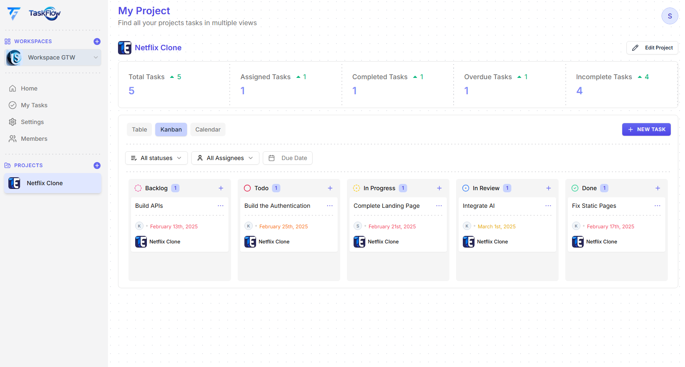
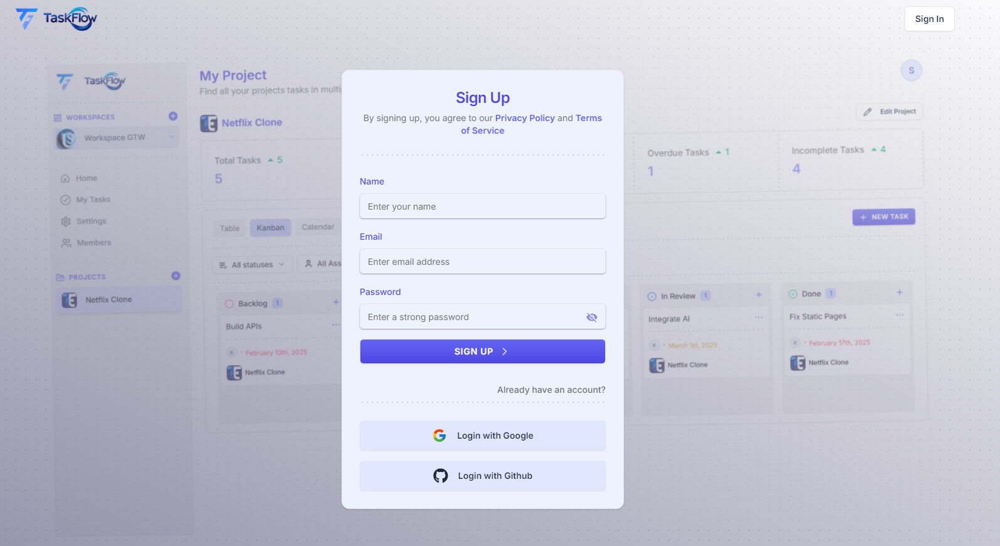
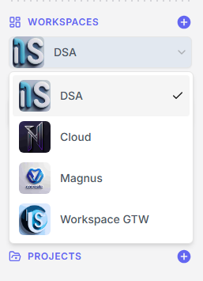
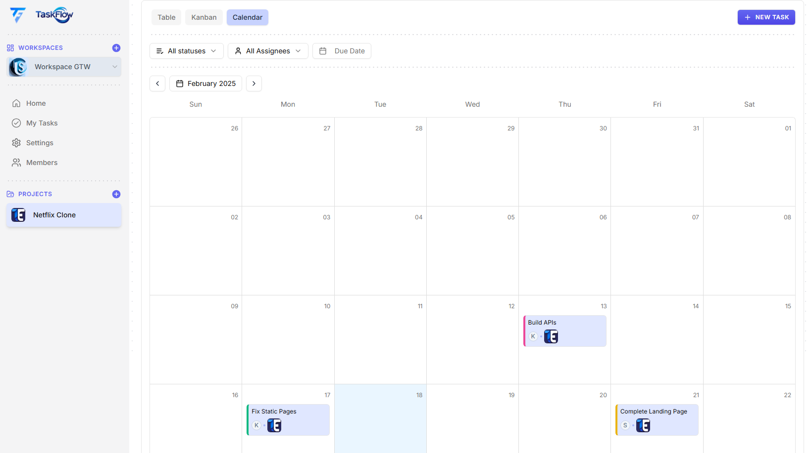
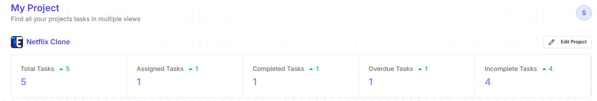
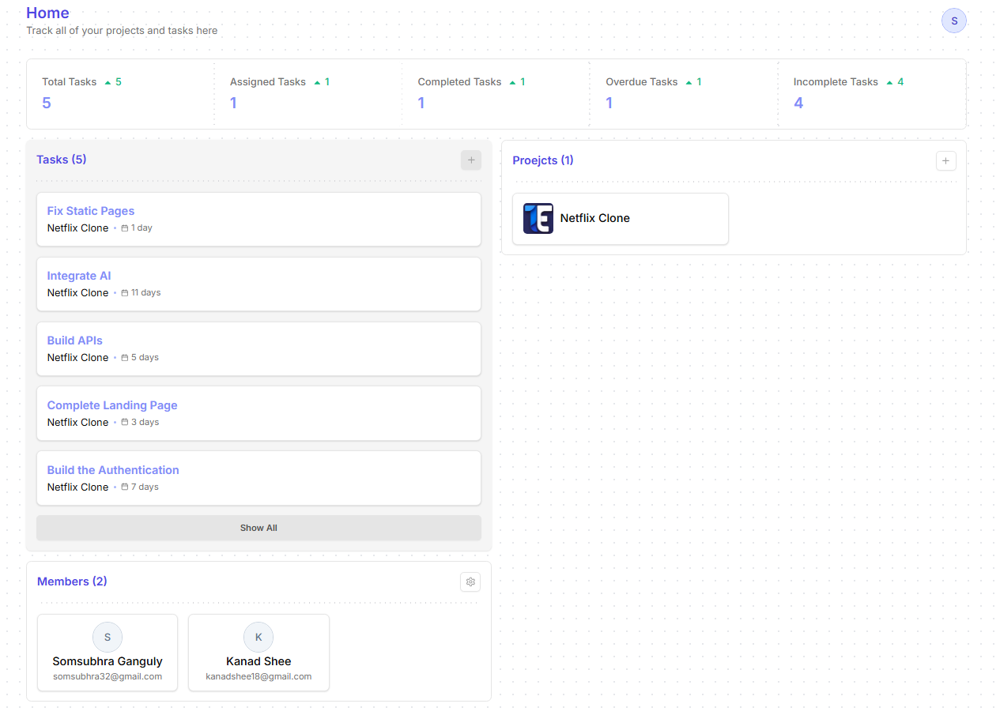

# TaskFlow

[Visit my site](https://taskflow-agile-pm.vercel.app)
TaskFlow is an **Agile Project Management Tool** designed to help teams efficiently manage their projects and tasks. It provides an intuitive interface for **workspace management, project tracking, task handling, and analytics** with multiple views like **Kanban, Calendar, and Data Tables**.

## ✨ Features

- **Authentication**: Secure login via OAuth (Google, GitHub) or email-password.
- **Workspaces**: Create, modify, delete workspaces & invite team members.
- **Projects**: Manage projects inside workspaces with full CRUD operations.
- **Task Management**: Create, update, delete tasks, assign users, and track progress.
- **Multiple Views**:
  - 📊 **Data Table View** for structured project tracking.
  - 📌 **Kanban View** for drag-and-drop task management.
  - 📅 **Calendar View** to track deadlines visually.
- **Analytics Dashboard**:
  - 📈 **Project Analytics**: Insights into project performance.
  - 🏢 **Workspace Analytics**: Overview of workspace activities.
- **Real-time Collaboration**: Users can work together efficiently within a shared workspace.
- **Notifications**: Stay updated with task changes and assignments.

## 🚀 Tech Stack

- **Frontend**: [Next.js](https://nextjs.org/) (React Framework)
- **Backend**: [Hono](https://hono.dev/) (Fast Edge API framework)
- **Database & Authentication**: [Appwrite](https://appwrite.io/) (Cloud backend for authentication, database, and storage)
- **State Management**: [TanStack Query](https://tanstack.com/query/latest) (Efficient API data fetching & caching)
- **Styling**: [Tailwind CSS](https://tailwindcss.com/) (Modern utility-first CSS)

## 📸 Screenshots

### 🔑 Authentication

### 🏢 Workspaces

### 📌 Kanban Board

### 📅 Calendar View

### 📊 Project Analytics

### 🏢 Workspace Analytics

## 🤝 Contributing

We welcome contributions! Feel free to open issues or create pull requests.

---

💡 _TaskFlow: Simplifying Agile Project Management!_

If you like this project, please give it a ⭐ and feel free to contribute! 🙌
